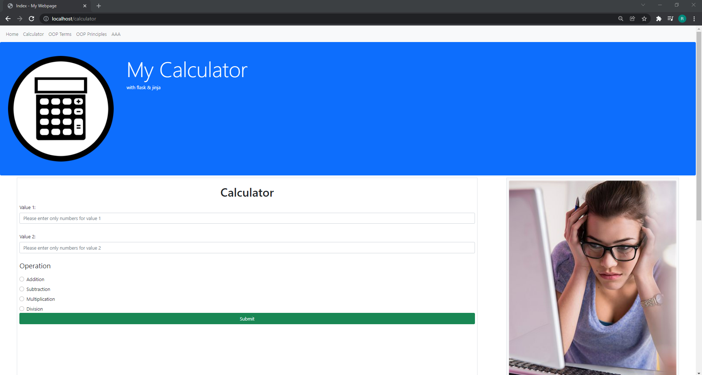
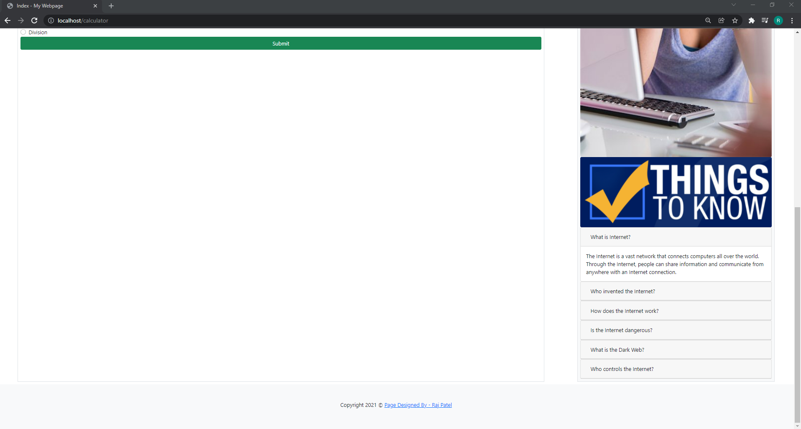
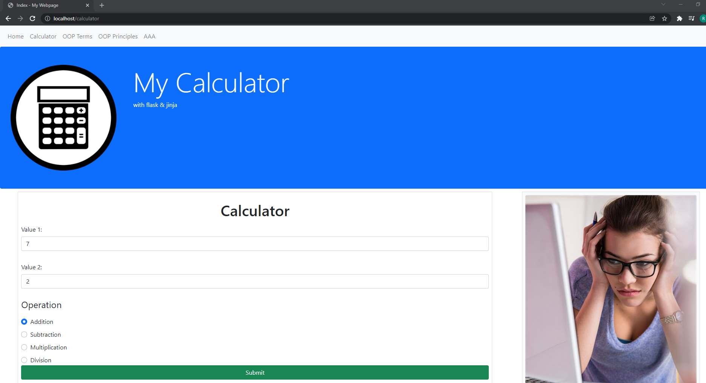
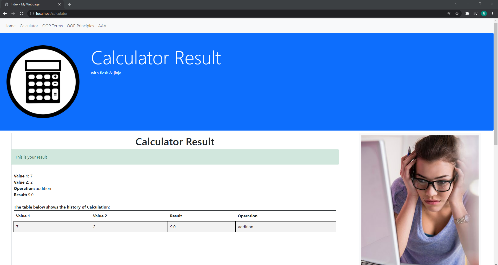
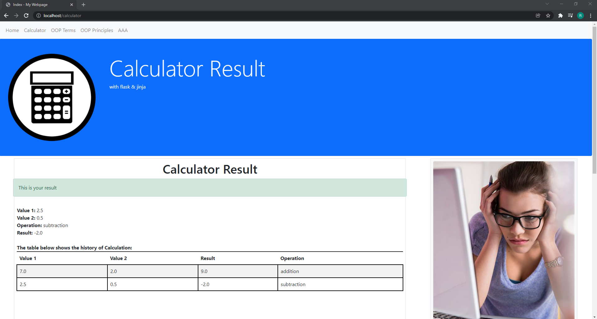
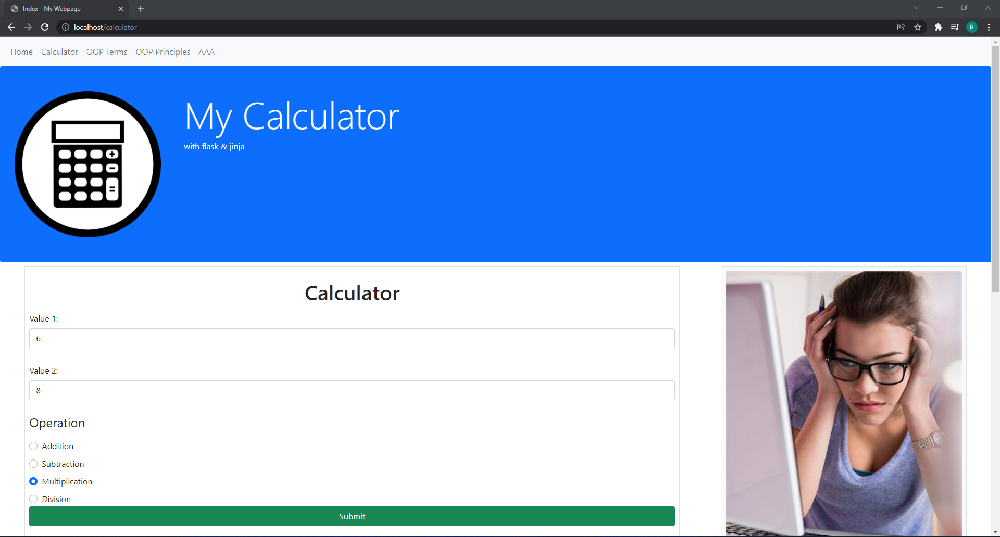
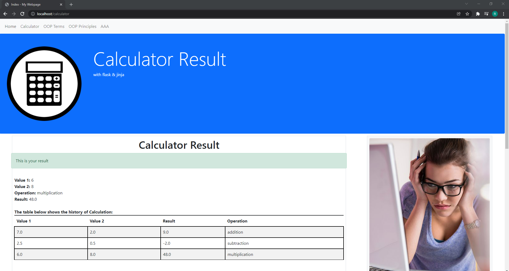
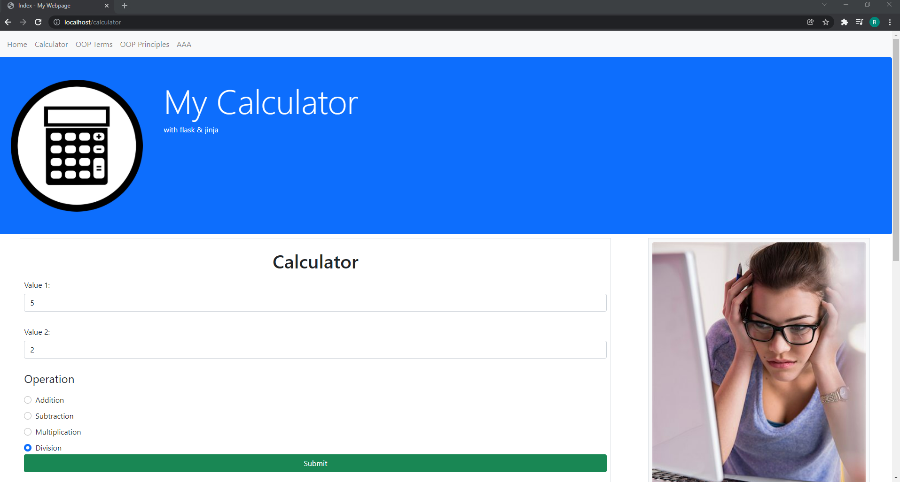
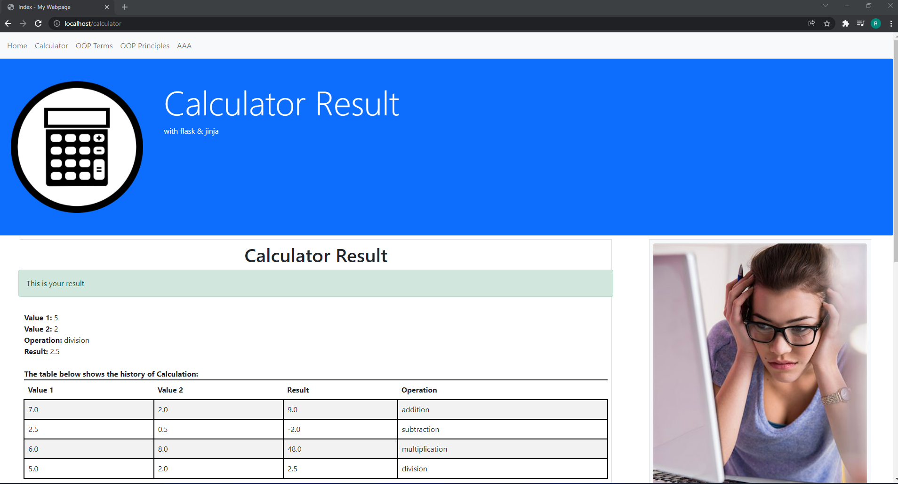

 Raj Patel : IS601 Fall 21
## Project 3: The screenshots are attached below:
### 1)Home Page

### 2)Calculator Page

### 3)Addition--Input and result :

### 4)Subtraction--Input and result :

### 5)Multiplication--Input and result :

### 6)Division--Input and result :

### 7)Final Table : Calculation History :

### 8)User Input Stored in CSV file :

### 9)Validation: Only Numbers allowed

### 10)Validation: Can't keep blank

## Output for Flash Error Message Assignment:

## Output for Beautiful Tables Assignment:

